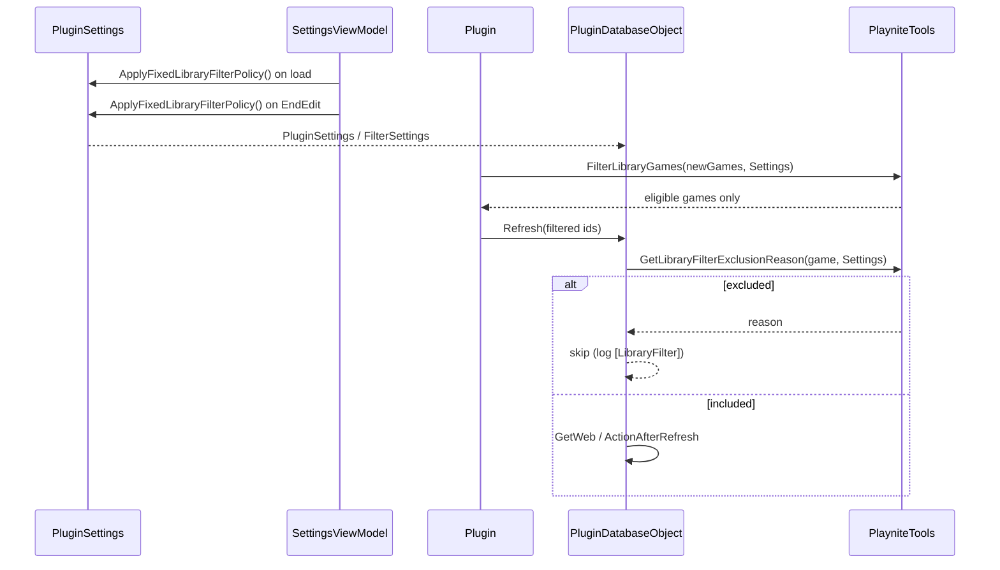

# Library filter

Guide for restricting Playnite library operations to games a plugin can actually process.

## Overview

Many Lacro59 plugins iterate the Playnite game library for refresh, tagging, bulk download, theme controls, and context menus. A full library often includes stores, emulated titles, and manual entries the plugin cannot handle.

**playnite-plugincommon** provides a shared library filter built on `IPluginSettings`. Once filter values are set on plugin settings, most `PluginDatabaseObject` and UI paths apply them automatically.

Two common strategies:

| Strategy | Use when |
| -------- | -------- |
| **Fixed policy** | Plugin support is fixed (specific store clients only). Values are enforced in code and usually not exposed in the settings UI. |
| **User-configurable** | End users should choose sources or emulated games. Bind filter properties in the settings view. |

This document focuses on the **fixed policy** pattern used by [CheckDlc](https://github.com/Lacro59/playnite-checkdlc-plugin) and [SystemChecker](https://github.com/Lacro59/playnite-systemchecker-plugin), and on the shared API every plugin author should use.

## Settings model

Filter options live on `PluginSettings` / `IPluginSettings`:

| Property | Type | Role |
| -------- | ---- | ---- |
| `IncludeEmulatedGames` | `bool` | When `false`, games with a Play Action tied to an emulator are excluded. |
| `LibrarySourceFilterMode` | `SourceFilterMode` | `All`, `Whitelist`, or `Blacklist`. |
| `EnabledSources` | `List<string>` | Source names included when mode is `Whitelist`. |
| `ExcludedSources` | `List<string>` | Source names excluded when mode is `Blacklist`. |

Source names are compared against `PlayniteTools.GetSourceName(game)` using case-insensitive partial matching (`SourceNamesMatch`).

Default values in `PluginSettings` allow the entire library (`IncludeEmulatedGames = true`, `LibrarySourceFilterMode = All`). Plugins that need a fixed scope must set these explicitly.

## Core API (`PlayniteTools`)

| Method | Purpose |
| ------ | ------- |
| `GetLibraryFilterExclusionReason(game, settings)` | Returns `null` if included, otherwise `"hidden"`, `"emulated"`, `"source"`, etc. |
| `ShouldIncludeLibraryGame(game, settings)` | Convenience wrapper — `true` when exclusion reason is `null`. |
| `FilterLibraryGames(games, settings)` | Filters a collection; logs a batch summary when games are removed. |
| `IsSourceEnabledForLibrary(game, settings)` | Source-only check (respects whitelist/blacklist mode). |
| `GetSourceName(game)` | Normalized source label used for matching. |
| `FormatSourceFilterForLog(settings)` | Short filter description for diagnostic logs. |
| `LogLibraryFilterExclusion(context, game, reason)` | Single-game exclusion log. |
| `LogLibraryFilterSummary(...)` | Batch exclusion log. |

All diagnostic logs use the `[LibraryFilter]` prefix. Enable plugin debug logging in Playnite to see them in `extensions.log`.

## Built-in coverage in plugincommon

When `PluginDatabase.PluginSettings` (also exposed as `FilterSettings`) holds active filter values, these paths are already filtered:

| Entry point | Location | Mechanism |
| ----------- | -------- | --------- |
| Bulk download dialog | `OptionsDownloadData` | `FilterLibraryGames` before closing the dialog |
| Tag all games | `PluginDatabaseObject.AddTagAllGames` | `FilterLibraryGames` |
| Tag selection | `AddTagSelectData` → `OptionsDownloadData` | Same pipeline |
| Refresh installed | `RefreshInstalled` | `FilterLibraryGames` |
| Refresh recent | `RefreshRecent` | `FilterLibraryGames` |
| Games with no data / old data | `GetGamesWithNoData`, `GetGamesOldData` | `FilterLibraryGames` |
| Single-game refresh (base) | `PluginDatabaseObject.RefreshNoLoader` | `GetLibraryFilterExclusionReason` at entry |
| Theme controls | `PluginUserControlExtend.UpdateDataAsync` | `ShouldIncludeLibraryGame` → control collapsed |

No extra code is required for these paths **after** settings are configured.

## Implementing a fixed filter policy

### Step 1 — Define supported sources

List normalized source names that match your store clients. Use names returned by `GetSourceName`, not raw Playnite plugin GUIDs.

Example (CheckDlc — stores covered by `source/Clients`):

```csharp
private static readonly IReadOnlyList<string> FixedSupportedSources = new List<string>
{
    "Steam",
    "Epic",
    "GOG",
    "EA app",
    "Origin",       // legacy label before EA app rebranding
    "Playstation",
    "Nintendo"
};
```

Include legacy aliases when users may still have old source labels in their library.

### Step 2 — Apply policy in settings

Add a method on your `PluginSettings` subclass and call it from the settings constructor:

```csharp
public void ApplyFixedLibraryFilterPolicy()
{
    IncludeEmulatedGames = false;
    LibrarySourceFilterMode = SourceFilterMode.Whitelist;
    EnabledSources = new List<string>(FixedSupportedSources);
    ExcludedSources = new List<string>();
}
```

Re-apply the policy whenever settings are loaded or saved so persisted JSON cannot override it:

```csharp
// Settings ViewModel constructor — after LoadPluginSettings / migrations
Settings.ApplyFixedLibraryFilterPolicy();

// EndEdit — before SavePluginSettings
Settings.ApplyFixedLibraryFilterPolicy();
```

Do **not** expose whitelist controls in the UI unless the plugin is designed for user-configurable filtering.

### Step 3 — Guard plugin-specific entry points

Audit code that reads from `PlayniteApi.Database.Games` or refreshes games outside `PluginDatabaseObject`. Typical bypass points:

| Bypass | Typical fix |
| ------ | ----------- |
| `OnLibraryUpdated` (auto-import) | `FilterLibraryGames` before `PluginDatabase.Refresh` |
| Custom game context menus | `ShouldIncludeLibraryGame` before building menu items |
| Override of `RefreshNoLoader` | Call `GetLibraryFilterExclusionReason` before store/API work |
| Override of `GetWeb` / `SetThemesResources` / `AppendPluginTag` | Same guard at method entry |
| Custom views listing cached data | Filter with `ShouldIncludeLibraryGame` on the parent game |

### Step 4 — Preserve manual-entry exceptions (optional)

Plugins that support manually added DLC entries often store an `IsManual` flag on cached items. Those entries may belong to a game whose Playnite source is **outside** the whitelist (for example, manual Steam DLC on a non-Steam game).

Skip the library filter when `IsManual == true`:

```csharp
if (loadedItem?.IsManual != true)
{
    string reason = PlayniteTools.GetLibraryFilterExclusionReason(game, PluginSettings);
    if (reason != null)
    {
        PlayniteTools.LogLibraryFilterExclusion("MyPlugin.RefreshNoLoader", game, reason);
        return;
    }
}
```

Apply the same pattern in `GetWeb`, `SetThemesResources`, `AppendPluginTag`, and any custom list views.

## Integration checklist

Use this when adding or reviewing library filter support in a plugin:

1. Define `FixedSupportedSources` (or user-facing filter UI).
2. Implement `ApplyFixedLibraryFilterPolicy()` on settings.
3. Call policy in settings ViewModel **constructor** and **EndEdit**.
4. Filter `OnLibraryUpdated` / auto-import if implemented.
5. Filter custom game menus with `ShouldIncludeLibraryGame`.
6. Add guards in database overrides (`RefreshNoLoader`, `GetWeb`, theme, tags).
7. Filter custom views that enumerate cached plugin data.
8. Document `IsManual` exceptions if applicable.
9. Verify with `[LibraryFilter]` logs in `extensions.log`.

## Architecture



## Logging and verification

Example log lines (CheckDlc session):

```text
[LibraryFilter] CheckDlcMenus: game menu hidden — no eligible game in selection (...)
[LibraryFilter] FilterLibraryGames: 4722 -> 2173 games (..., excluded source=2457)
[LibraryFilter] CheckDlc.SetThemesResources: excluded 'Roblox' (...) — reason=source (Microsoft Store)
```

Batch operations log counts only when at least one game was excluded. Single-game exclusions always log at debug level.

## Source name notes

`GetSourceName` resolves names in this order:

1. `GetSourceByPluginId(game.PluginId)` when the library plugin is mapped.
2. Emulator-specific labels (`RetroAchievements`, `Rpcs3`, …) for emulated games.
3. Playnite source record name (`game.SourceId`).
4. Fallback: `"Playnite"`.

When adding whitelist entries for a new store:

- Test with real library entries and inspect logs (`reason=source (...)`).
- Add legacy aliases if Playnite renamed the source (for example `Origin` vs `EA app`).
- If `GetSourceByPluginId` returns empty for a library plugin, whitelist matching may still work via partial match on the source record name — verify at runtime.

## Out of scope

These paths intentionally ignore the library filter:

| Path | Reason |
| ---- | ------ |
| `ExtractToCsv` | Exports existing plugin database entries regardless of current filter |
| `RemoveTagAllGames` | Global tag cleanup across the Playnite library |

## Reference implementations

| Plugin | Settings | Notable guards |
| ------ | -------- | -------------- |
| [CheckDlc](https://github.com/Lacro59/playnite-checkdlc-plugin) | `CheckDlcSettings.ApplyFixedLibraryFilterPolicy` | `OnLibraryUpdated`, `CheckDlcMenus`, `CheckDlcDatabase`, `CheckDlcFreeView` |
| [SystemChecker](https://github.com/Lacro59/playnite-systemchecker-plugin) | `SystemCheckerSettings.ApplyFixedLibraryFilterPolicy` | Same fixed-policy pattern |

For the shared implementation, see:

- `CommonPluginsShared/PlayniteTools.cs` — filter API
- `CommonPluginsShared/Plugins/PluginSettings.cs` — default properties
- `CommonPluginsShared/Collections/PluginDatabaseObject.cs` — protected helpers and base `RefreshNoLoader`
- `CommonPluginsShared/Controls/PluginUserControlExtend.cs` — theme control filtering
- `CommonPluginsControls/Views/OptionsDownloadData.xaml.cs` — bulk download filtering
