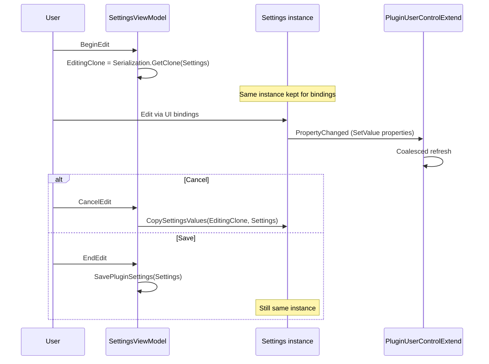

# Plugin settings — mutable instance and live UI refresh

Guidelines for plugins based on `playnite-plugincommon` so integrated theme controls refresh immediately after settings changes, without restarting Playnite.

## Problem

Theme controls (`PluginUserControlExtend`) subscribe once to `PluginDatabase.PluginSettings.PropertyChanged`. If the settings view model replaces that instance during `EndEdit()` or `CancelEdit()`, subscribers keep listening to the old object and the UI stops updating.

## Contract — single mutable instance

| Rule                 | Detail                                                                                                                          |
| -------------------- | ------------------------------------------------------------------------------------------------------------------------------- |
| One runtime instance | `PluginSettingsViewModel.Settings` and `PluginDatabase.PluginSettings` must reference the **same** object for the whole session |
| No swap on save      | `EndEdit()` persists values but must **not** assign a new instance to `PluginDatabase.PluginSettings`                           |
| No swap on cancel    | `CancelEdit()` must restore values **in place**, not replace `Settings` with the editing clone                                  |
| Bootstrap            | `PluginExtended` passes `PluginSettingsViewModel.Settings` into the database constructor at startup                             |

Reference: `CommonPluginsShared/PlayniteExtended/PluginExtended.cs`.

## Settings edit lifecycle



### BeginEdit

1. Capture a snapshot: `EditingClone = Serialization.GetClone(Settings)`.
2. Keep editing through `Settings` bindings (not the clone).
3. Reload any plugin-specific sub-view-models from `Settings`.

### CancelEdit

1. Restore snapshot in place: `CopySettingsValues(EditingClone, Settings)`.
2. Use the helper on `PluginSettingsViewModel` (includes inherited `PluginSettings` properties via `FlattenHierarchy`).
3. Restore plugin-specific sub-view-models if applicable.

### EndEdit

1. Normalize and persist: `SavePluginSettings(Settings)`.
2. Do **not** reassign `PluginDatabase.PluginSettings`.
3. Apply any desktop-only integration side effects (menus, panels) from current `Settings` values.

## Live properties

Properties that should refresh integrated controls must notify through `SetValue(...)` on `ObservableObject` (or `PluginSettings`).

| Signal                           | Meaning                                                           |
| -------------------------------- | ----------------------------------------------------------------- |
| `SetValue` backing field         | Property is a natural candidate for live refresh                  |
| Auto-property `{ get; set; }`    | Value changes silently — controls only see it on next full reload |
| `[DontSerialize]` runtime fields | May use `SetValue`; excluded from JSON persistence                |

There is no fixed allow-list of “live” settings: if a property drives theme UI and should update without restart, implement it with `SetValue`.

## Control-side refresh

`PluginUserControlExtend` registers once per plugin key:

```csharp
PluginDatabase.PluginSettings.PropertyChanged += CreatePluginSettingsHandler();
```

On notification, `PluginUserControlExtendBase` coalesces bursts (50 ms) and calls `SetDefaultDataContext()` on all live instances, then schedules a data refresh.

Plugin controls should read integration flags in `SetDefaultDataContext()` from `PluginDatabase.PluginSettings`.

## Implementation checklist (new plugin)

1. Inherit settings from `PluginSettings` and the view model from `PluginSettingsViewModel`.
2. Use `PluginExtended<TSettingsViewModel, TDatabase>` so database and view model share one settings instance.
3. In `BeginEdit`, clone to `EditingClone` only — keep binding to `Settings`.
4. In `CancelEdit`, call `CopySettingsValues(EditingClone, Settings)`.
5. In `EndEdit`, save without swapping `PluginDatabase.PluginSettings`.
6. Expose UI-driving settings with `SetValue`.
7. Subscribe in theme controls via `CreatePluginSettingsHandler()` inside `AttachPluginEvents`.

## Anti-patterns

| Do not                                                  | Why                                  |
| ------------------------------------------------------- | ------------------------------------ |
| `PluginDatabase.PluginSettings = Settings` in `EndEdit` | Breaks `PropertyChanged` subscribers |
| `Settings = EditingClone` in `CancelEdit`               | Same breakage                        |
| Replace `Settings` reference after load                 | Database and controls may diverge    |
| Auto-properties for theme-visible toggles               | No live refresh                      |

## Reference implementation

Screenshots Visualizer (`ScreenshotsVisualizerSettingsViewModel` in `ScreenshotsVisualizerSettings.cs`) follows this contract.

## API

```csharp
// PluginSettingsViewModel — restore snapshot without instance swap
protected static void CopySettingsValues<TSettings>(TSettings source, TSettings target)
    where TSettings : class;
```

Located in `CommonPluginsShared/Plugins/PluginSettingsViewModel.cs`.
