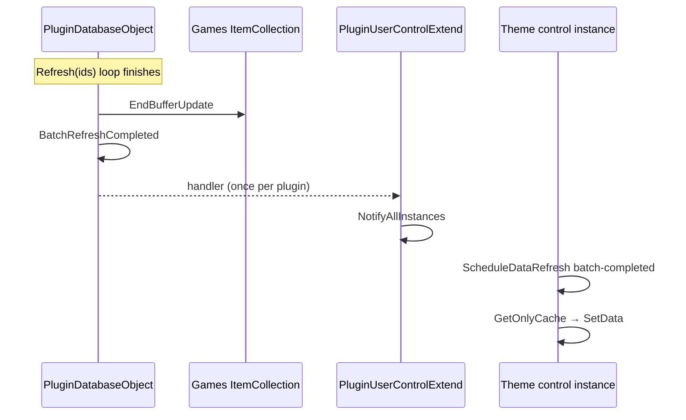

# Plugin user controls

Theme-integrated WPF controls that display per-game plugin data in Playnite Desktop (game details panel, grid item templates, and similar extension points).

This document describes the control stack in `CommonPluginsShared.Controls`, how data reaches the UI, and the **post-batch refresh** mechanism added to fix stale UI after large multi-game `Refresh()` operations.

## Class hierarchy

```text
Playnite.SDK.Controls.PluginUserControl
  └── PluginUserControlExtendBase     ← debounce, instance registry, Playnite game events
        └── PluginUserControlExtend   ← plugin database integration, cache lookup, batch refresh hook
              └── YourPluginButton / YourPluginList / …
```

| Class                         | Role                                                                                                     |
| ----------------------------- | -------------------------------------------------------------------------------------------------------- |
| `PluginUserControlExtendBase` | Game context tracking, debounced refresh, static `NotifyAllInstances`, Playnite `Games.ItemUpdated`      |
| `PluginUserControlExtend`     | Reads plugin cache via `IPluginDatabase.GetOnlyCache`, wires `BatchRefreshCompleted` for all derivatives |

Prefer **`PluginUserControlExtend`** for any control bound to `PluginDatabaseObject`. Use **`PluginUserControlExtendBase`** only when you do not use the shared database layer (rare).

## How controls are hosted in Playnite

Each plugin registers controls through `GenericPlugin.GetGameViewControl(GetGameViewControlArgs args)` (or equivalent in `PluginExtended`). Playnite creates one control instance per theme slot and per visible game (grid virtualization may create and destroy instances frequently).

Typical XAML root:

```xml
<controls:PluginUserControlExtend
    x:Class="MyPlugin.Controls.PluginButton"
    … />
```

Code-behind must call `Loaded += OnLoaded` (the protected `OnLoaded` on `PluginUserControlExtend` wires static events once per concrete type).

## Instance registry and static events

Many controls of the same type can exist at once (library grid). To avoid subscribing to database events hundreds of times, the base classes use:

1. **`_instances`** — `List<WeakReference<PluginUserControlExtendBase>>` of alive controls.
2. **`NotifyAllInstances(Action<…>)`** — dispatches a callback to every living instance on the UI thread.
3. **`AttachPluginEvents(pluginKey, Action)`** — runs the attach action **once per `pluginKey`** (shared across all control types of the same plugin).

Dead weak references are removed when an instance fires `Unloaded` or during the next `NotifyAllInstances` pass.

## Update pipeline

### Triggers

| Source                       | Handler / path                              | Scope per instance                             |
| ---------------------------- | ------------------------------------------- | ---------------------------------------------- |
| Game selection change        | `GameContextChanged`                        | Current game; leading-edge refresh on switch   |
| Plugin DB item update        | `DatabaseItemUpdated`                       | Only if `updatedIds` contains `GameContext.Id` |
| Plugin DB collection change  | `DatabaseItemCollectionChanged`             | Any instance with `GameContext != null`        |
| Playnite game model update   | `Games.ItemUpdated` (coalesced after batch) | Only if updated game matches `GameContext`     |
| Plugin settings change       | `PropertyChanged` (50 ms coalesced)         | All activated instances                        |
| **Multi-game batch refresh** | **`BatchRefreshCompleted`**                 | **All activated instances with `GameContext`** |

### Debouncing

- Short delay: `Delay` dependency property (default **10 ms**).
- Anti-starvation deadline: **250 ms** (`MaxUpdateDelayMs`) — fires even if debounce keeps resetting.
- Each scheduled refresh increments `_scheduledUpdateGeneration` so stale async work can be ignored.

Diagnostic `reason` strings passed to `ScheduleDataRefresh` include: `context-switch`, `database-item-updated`, `playnite-game-updated`, `settings-changed`, **`batch-completed`**, and others.

### Data read path (`PluginUserControlExtend.UpdateDataAsync`)

1. Validate `GameContext` / `CurrentGame` alignment.
2. Apply library filter settings (`FilterSettings`) — collapse if excluded.
3. **`pluginDatabase.GetOnlyCache(game)`** — in-memory only, **no disk or network**.
4. Collapse when no cache entry or `HasData == false` (unless `AlwaysShow`).
5. Call overridden **`SetDataAsync`** / **`SetData`** to bind view-model / visibility.

Important: UI refresh after batch operations uses the **session cache** already populated during `RefreshNoLoader`. No extra store/API calls are made.

## Implementing a new control

### 1. View-model (`IDataContext`)

```csharp
public class MyControlDataContext : ObservableObject, IDataContext
{
    public bool IsActivated { get; set; }  // tied to plugin settings toggle
}
```

`IsActivated` gates whether `ScheduleDataRefresh` runs.

### 2. Code-behind skeleton

```csharp
public partial class PluginButton : PluginUserControlExtend
{
    private static MyDatabase PluginDatabase => MyPlugin.PluginDatabase;
    protected override IPluginDatabase pluginDatabase => PluginDatabase;

    protected override IDataContext controlDataContext => _dataContext;

    public PluginButton()
    {
        InitializeComponent();
        DataContext = _dataContext;
        Loaded += OnLoaded;
    }

    protected override void AttachStaticEvents()
    {
        base.AttachStaticEvents();  // includes BatchRefreshCompleted

        AttachPluginEvents(PluginDatabase.PluginName, () =>
        {
            PluginDatabase.PluginSettings.PropertyChanged += CreatePluginSettingsHandler();
            PluginDatabase.DatabaseItemUpdated += CreateDatabaseItemUpdatedHandler<MyItem>();
            PluginDatabase.DatabaseItemCollectionChanged += CreateDatabaseCollectionChangedHandler<MyItem>();
        });
    }

    public override void SetDefaultDataContext()
    {
        _dataContext.IsActivated = PluginDatabase.PluginSettings.EnableMyControl;
    }

    public override void SetData(Game game, PluginGameEntry entry)
    {
        // Bind UI from cached entry
    }
}
```

### 3. What you must wire yourself

| Event                            | Where to subscribe                         | Notes                               |
| -------------------------------- | ------------------------------------------ | ----------------------------------- |
| `BatchRefreshCompleted`          | **Automatic** in `PluginUserControlExtend` | No plugin code required             |
| `DatabaseItemUpdated<TItem>`     | Your `AttachStaticEvents`                  | Requires concrete `TItem` type      |
| `DatabaseItemCollectionChanged`  | Your `AttachStaticEvents`                  | Same                                |
| `PluginSettings.PropertyChanged` | Your `AttachStaticEvents`                  | Use `CreatePluginSettingsHandler()` |

Use the **same `pluginKey`** (`PluginDatabase.PluginName`) in `AttachPluginEvents` for all controls of one plugin so handlers attach only once.

### 4. Register the control in the plugin

Return the control from `GetGameViewControl` for the desired `GameViewExtension` / `GameViewExtensionPoint` (see Playnite SDK tutorials).

## Multi-game batch refresh and UI

### Problem

During `PluginDatabaseObject.Refresh(IEnumerable<Guid> ids)` over hundreds of games:

- `DatabaseItemUpdated` fires **once per game** but each control instance only reacts to **its own** `GameContext.Id`.
- Debounce storms and virtualization (`Unloaded` instances removed from `_instances`) can leave visible controls stale even though cache and disk data are correct.
- A single coalesced `Games.ItemUpdated` at buffer end is not always enough (e.g. control stayed `Collapsed`, `IsSameGameAlreadyDisplayed` guard).

### Solution (2026-06)

After a **multi-game** batch completes and Playnite buffers are flushed, the database raises **`BatchRefreshCompleted`**. All living `PluginUserControlExtend` instances schedule one cache-only refresh.



### API

**Event** — on `PluginDatabaseObject` and `IPluginDatabase`:

```csharp
event EventHandler<BatchRefreshCompletedEventArgs> BatchRefreshCompleted;
```

**Args** — `BatchRefreshCompletedEventArgs`:

| Property         | Meaning                                  |
| ---------------- | ---------------------------------------- |
| `ProcessedCount` | Games processed before completion/cancel |
| `TotalCount`     | Games in the original batch request      |
| `Canceled`       | User canceled the progress dialog        |

#### When it fires

- Inside `Refresh(IEnumerable<Guid> ids, string message)`, **after** `ExecuteWithPlayniteBufferedUpdates` returns (Playnite `Database` + `Games` buffers ended).
- Only if **`idList.Count > 1`** and **`processedCount > 0`**.
- Single-game refresh (`Refresh(Guid id)`) is **unchanged** and does not raise this event.

#### UI subscription

Centralized in `PluginUserControlExtend.AttachStaticEvents`:

```csharp
AttachPluginEvents(pluginDatabase.PluginName + ".BatchRefreshCompleted", () =>
{
    pluginDatabase.BatchRefreshCompleted += CreateBatchRefreshCompletedHandler();
});
```

`CreateBatchRefreshCompletedHandler()` (on `PluginUserControlExtendBase`) calls `NotifyAllInstances` → `OnBatchRefreshCompleted()` → `ScheduleDataRefresh("batch-completed")` for each instance with `GameContext != null` and an activated settings flag.

### Scope and limitations

| Scenario                                       | Behaviour                                                                  |
| ---------------------------------------------- | -------------------------------------------------------------------------- |
| All plugins using `PluginUserControlExtend`    | Post-batch UI refresh enabled after updating `playnite-plugincommon`       |
| Controls on `PluginUserControlExtendBase` only | Must subscribe to `BatchRefreshCompleted` manually                         |
| Virtualized grid cells currently unloaded      | Not in `_instances`; refresh on next `GameContextChanged` when scrolled in |
| Native Playnite features (`FeatureIds`, tags)  | Separate from plugin controls; may need manual verification after batch    |
| Network / performance                          | No additional fetch; cache read only                                       |
| Transient auth failures during batch           | UI auth notifications suppressed; one log line per store per batch (CheckDLC `GenericDlc`) |

## Batch refresh data layer (context)

`Refresh(IEnumerable<Guid>)` uses three buffering layers:

1. `ExecuteWithPlayniteBufferedUpdates` — Playnite `Database` + `Games`.
2. `_database.BufferedUpdate()` — plugin item collection writes.
3. Per game: `RefreshNoLoader` → optional `Update` → `ActionAfterRefresh` (e.g. Playnite `FeatureIds`).

`DatabaseItemUpdated` is raised immediately on each `Update()` (not deferred by the plugin item buffer). `Games.ItemUpdated` is coalesced until `EndBufferUpdate`.

## Debugging tips

- Enable DEBUG builds for `DebugTimer` and verbose `LogControlTrace` output.
- Search logs for `ScheduleDataRefresh` reason strings (`batch-completed`, `database-item-updated`, …).
- `LogControlIssue` marks aborted updates (context mismatch, missing cache, deadline timer).
- Instance id format: `{TypeName}#{HashCode}` via `GetInstanceDiagnosticId()`.

## See also

- [Documentation index](README.md)
- `CommonPluginsShared/Controls/PluginUserControlExtendBase.cs`
- `CommonPluginsShared/Controls/PluginUserControlExtend.cs`
- `CommonPluginsShared/Collections/PluginDatabaseObject.cs`
- `CommonPluginsShared/Collections/BatchRefreshCompletedEventArgs.cs`
- Playnite SDK: `@Playnite 10.x - Tutorials` — game view extensions
